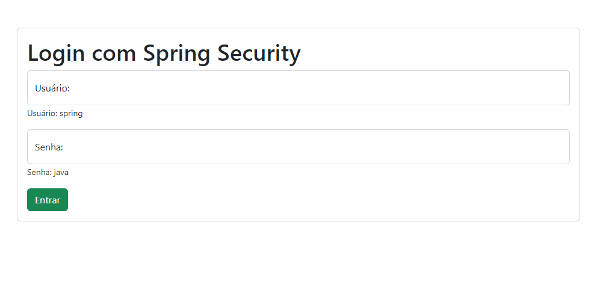
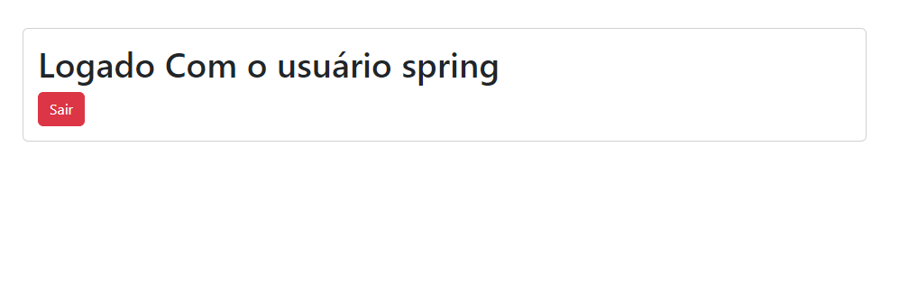

# Controle de acesso em aplicações Web com Spring Security.
##### Criando funcionalidade simples de controle de acesso em aplicações Web com Spring Security, Spring Web e Thymeleaf. Essa aplicação utiliza como gerenciador de dependência Maven e o Java na versão 11.

## Criando as Views.
### Antes de criar a a classe de configuração para o controle de acesso da aplicação iremos criar as views. Utilizei o framework Bootstrap para melhorar a qualidade visual da aplicação, mas mantendo a simplicidade. Os arquivos HTML devem estar no pasta templates dentro de resources.

### A idéia é que quando um usuário acessar a página da `` home `` exista um link que direcione o usuário para a página `` hello ``, porém é necessário estar autenticado para prosseguir, caso não esteja a aplicação deverá redirecionar o usuário para tela de login. 

### Vamos criar três telas para a visualização.

## home.html

```
<html lang="pt-br">
<head>
<meta charset="UTF-8">
<meta name="viewport" content="width=device-width, initial-scale=1">
<title>Spring Security</title>
 <link href="https://cdn.jsdelivr.net/npm/bootstrap@5.2.0/dist/css/bootstrap.min.css" rel="stylesheet" integrity="sha384-gH2yIJqKdNHPEq0n4Mqa/HGKIhSkIHeL5AyhkYV8i59U5AR6csBvApHHNl/vI1Bx" crossorigin="anonymous">
</head>
<body>
	<h1>Bem-Vindo!</h1>
	
	<p>Click <a th:href="@{/hello}">aqui</a> para acessar o sistema!

<script src="https://cdn.jsdelivr.net/npm/@popperjs/core@2.11.5/dist/umd/popper.min.js" integrity="sha384-Xe+8cL9oJa6tN/veChSP7q+mnSPaj5Bcu9mPX5F5xIGE0DVittaqT5lorf0EI7Vk" crossorigin="anonymous"></script>
<script src="https://cdn.jsdelivr.net/npm/bootstrap@5.2.0/dist/js/bootstrap.min.js" integrity="sha384-ODmDIVzN+pFdexxHEHFBQH3/9/vQ9uori45z4JjnFsRydbmQbmL5t1tQ0culUzyK" crossorigin="anonymous"></script>
</body>
</html> 
```  

## hello.html

```
<!DOCTYPE html>
<html lang="pt-br">
<head>
<meta charset="UTF-8">
<meta name="viewport" content="width=device-width, initial-scale=1">
<title>Spring Security</title>
 <link href="https://cdn.jsdelivr.net/npm/bootstrap@5.2.0/dist/css/bootstrap.min.css" rel="stylesheet" integrity="sha384-gH2yIJqKdNHPEq0n4Mqa/HGKIhSkIHeL5AyhkYV8i59U5AR6csBvApHHNl/vI1Bx" crossorigin="anonymous">
</head>
<body>
<div class="container pt-5">
	<div class="card ">
		<div class="card-body">
			<h1 th:inline="text">Logado Com o usuário [[${#httpServletRequest.remoteUser}]]</h1>
				<form th:action="@{/logout}" method="post">
		     <button type="submit" class="btn btn-danger">Sair</button>
		</form>
		</div>
	</div>
</div>
<script src="https://cdn.jsdelivr.net/npm/@popperjs/core@2.11.5/dist/umd/popper.min.js" integrity="sha384-Xe+8cL9oJa6tN/veChSP7q+mnSPaj5Bcu9mPX5F5xIGE0DVittaqT5lorf0EI7Vk" crossorigin="anonymous"></script>
<script src="https://cdn.jsdelivr.net/npm/bootstrap@5.2.0/dist/js/bootstrap.min.js" integrity="sha384-ODmDIVzN+pFdexxHEHFBQH3/9/vQ9uori45z4JjnFsRydbmQbmL5t1tQ0culUzyK" crossorigin="anonymous"></script>
</body>
</html>

```
e finalmente a tela de login.

## login.html

```
<!DOCTYPE html>
<html lang="pt-br">
<head>
<meta charset="UTF-8">
<meta name="viewport" content="width=device-width, initial-scale=1">
<title>Spring Security</title>
 <link href="https://cdn.jsdelivr.net/npm/bootstrap@5.2.0/dist/css/bootstrap.min.css" rel="stylesheet" integrity="sha384-gH2yIJqKdNHPEq0n4Mqa/HGKIhSkIHeL5AyhkYV8i59U5AR6csBvApHHNl/vI1Bx" crossorigin="anonymous">
</head>
<body>
<div class="container pt-5">
	<div class="card ">
		<div class="card-body">
			<h1 th:inline="text">Logado Com o usuário [[${#httpServletRequest.remoteUser}]]</h1>
				<form th:action="@{/logout}" method="post">
		     <button type="submit" class="btn btn-danger">Sair</button>
		</form>
		</div>
	</div>
</div>
<script src="https://cdn.jsdelivr.net/npm/@popperjs/core@2.11.5/dist/umd/popper.min.js" integrity="sha384-Xe+8cL9oJa6tN/veChSP7q+mnSPaj5Bcu9mPX5F5xIGE0DVittaqT5lorf0EI7Vk" crossorigin="anonymous"></script>
<script src="https://cdn.jsdelivr.net/npm/bootstrap@5.2.0/dist/js/bootstrap.min.js" integrity="sha384-ODmDIVzN+pFdexxHEHFBQH3/9/vQ9uori45z4JjnFsRydbmQbmL5t1tQ0culUzyK" crossorigin="anonymous"></script>
</body>
</html>

```


## Criando a Controller das Views.

### Para que o Spring consiga exibir as telas da aplicação é necessário realizar a criação e configuração da classe `` MvcConfig `` e criar um metodo para mapear as páginas da aplicação conforme exemplo abaixo:

```
package br.com.felipesoares.login.securingweb;

import org.springframework.context.annotation.Configuration;
import org.springframework.web.servlet.config.annotation.ViewControllerRegistry;
import org.springframework.web.servlet.config.annotation.WebMvcConfigurer;

@Configuration
public class MvcConfig implements WebMvcConfigurer {
	
	public void addViewControllers(ViewControllerRegistry registry) {
		registry.addViewController("/home").setViewName("home");
		registry.addViewController("/").setViewName("home");
		registry.addViewController("/hello").setViewName("hello");
		registry.addViewController("/login").setViewName("login");
	}
}

```

## Arquivo Pom.xml
### Conforme explicando anteriormente estamos utilizando o Mavem como gerenciador de dependências e essas são as dependências desse projeto localizado no arquivo pom.xml

```
<?xml version="1.0" encoding="UTF-8"?>
<project xmlns="http://maven.apache.org/POM/4.0.0" xmlns:xsi="http://www.w3.org/2001/XMLSchema-instance"
	xsi:schemaLocation="http://maven.apache.org/POM/4.0.0 https://maven.apache.org/xsd/maven-4.0.0.xsd">
	<modelVersion>4.0.0</modelVersion>
	<parent>
		<groupId>org.springframework.boot</groupId>
		<artifactId>spring-boot-starter-parent</artifactId>
		<version>2.7.2</version>
		<relativePath/> <!-- lookup parent from repository -->
	</parent>
	<groupId>br.com.felipesoares</groupId>
	<artifactId>login</artifactId>
	<version>0.0.1-SNAPSHOT</version>
	<name>login</name>
	<description>Demo project for Spring Boot</description>
	<properties>
		<java.version>11</java.version>
	</properties>
	<dependencies>
		<dependency>
			<groupId>org.springframework.boot</groupId>
			<artifactId>spring-boot-starter-thymeleaf</artifactId>
		</dependency>
		<dependency>
			<groupId>org.springframework.boot</groupId>
			<artifactId>spring-boot-starter-web</artifactId>
		</dependency>
		<dependency>
			<groupId>org.springframework.boot</groupId>
			<artifactId>spring-boot-devtools</artifactId>
			<scope>runtime</scope>
			<optional>true</optional>
		</dependency>
		<dependency>
			<groupId>org.springframework.boot</groupId>
			<artifactId>spring-boot-starter-test</artifactId>
			<scope>test</scope>
		</dependency>
		<dependency>
			<groupId>org.springframework.boot</groupId>
			<artifactId>spring-boot-starter-security</artifactId>
		</dependency>
		<dependency>
			<groupId>org.springframework.security</groupId>
			<artifactId>spring-security-test</artifactId>
			<scope>test</scope>
		</dependency>
	</dependencies>

	<build>
		<plugins>
			<plugin>
				<groupId>org.springframework.boot</groupId>
				<artifactId>spring-boot-maven-plugin</artifactId>
			</plugin>
		</plugins>
	</build>

</project>

```
## Configuando e criando a classe para a segurança e autendicação dos usuários.

### Essa classe deve estar no pacote principal da aplicação com o nome de `` WebSecurityConfig `` 

```
package br.com.felipesoares.login;

import org.springframework.context.annotation.Bean;
import org.springframework.context.annotation.Configuration;
import org.springframework.security.config.annotation.web.builders.HttpSecurity;
import org.springframework.security.config.annotation.web.configuration.EnableWebSecurity;
import org.springframework.security.core.userdetails.User;
import org.springframework.security.core.userdetails.UserDetails;
import org.springframework.security.core.userdetails.UserDetailsService;
import org.springframework.security.provisioning.InMemoryUserDetailsManager;
import org.springframework.security.web.SecurityFilterChain;

@Configuration
@EnableWebSecurity
public class WebSecurityConfig {
	
	
	@Bean
	public SecurityFilterChain securityFilterChain(HttpSecurity http) throws Exception {
		http.authorizeHttpRequests((requests) -> requests
				.antMatchers("/", "/home").permitAll()
				.anyRequest().authenticated()	
				).formLogin((form) -> form
						.loginPage("/login")
						.permitAll()
				).logout((logout) -> logout.permitAll());
		return http.build();
	}
	
	@Bean
	public UserDetailsService userDetailService() {
			UserDetails user =
					User.withDefaultPasswordEncoder()
						.username("spring")
						.password("java")
						.roles("ADM")
						.build();
			
			return new InMemoryUserDetailsManager(user);
		
	}
}

```
### O bean `` SecurityFilterChain `` define regras que de segurança e informa para a aplicação as paginas que estam liberadas para o acesso e a pagina para direcionar para o login.   

```
 @Bean
	public SecurityFilterChain securityFilterChain(HttpSecurity http) throws Exception {
		http.authorizeHttpRequests((requests) -> requests
				.antMatchers("/", "/home").permitAll()
				.anyRequest().authenticated()	
				).formLogin((form) -> form
						.loginPage("/login")
						.permitAll()
				).logout((logout) -> logout.permitAll());
		return http.build();
	}
```

### O bean `` UserDetailsService  `` cria a configuração de acesso para o usuário e registra as informações em memória, caso não seja feita essa configuração o spring gera um usuário padrão e uma senha para teste.

```
@Bean
	public UserDetailsService userDetailService() {
			UserDetails user =
					User.withDefaultPasswordEncoder()
						.username("spring")
						.password("java")
						.roles("ADM")
						.build();
			
			return new InMemoryUserDetailsManager(user);

```
## Ainda faltou um detalhe.

### É importante fazer uma alteração antes de rodar na classe da aplicação.
```
package br.com.felipesoares.login;

import org.springframework.boot.SpringApplication;
import org.springframework.boot.autoconfigure.SpringBootApplication;
import org.springframework.boot.autoconfigure.jdbc.DataSourceAutoConfiguration;

@SpringBootApplication(exclude = {DataSourceAutoConfiguration.class })
public class LoginApplication {

	public static void main(String[] args) throws Throwable {
		SpringApplication.run(LoginApplication.class, args);
	}

}

```
### A notação ``@SpringBootApplication(exclude = {DataSourceAutoConfiguration.class }) `` deve ser configurado dessa forma para não haver problema na hora da execução.

## Rotando a aplicação

### A maneira que acho mais fácil é utilizando a IDE do Eclipse.
1. faça o download do aplicação.
1. abra o Eclipse.
1. escolha a opção de importar arquivo já existente.
1. escolha a opção de projeto Mavem.
1. aponte o caminho para o editor.
1. inície o servidor.
1. no navegador digite ``http://localhost:8080/ ``
1. pronto se tudo correu bem você será direcionado para pagina `` home``.

## Como ficou a aplicação.

## home.html

## login.html

## hello.html


##### Para mais informações acesse o site do Spring `` spring.io ``.